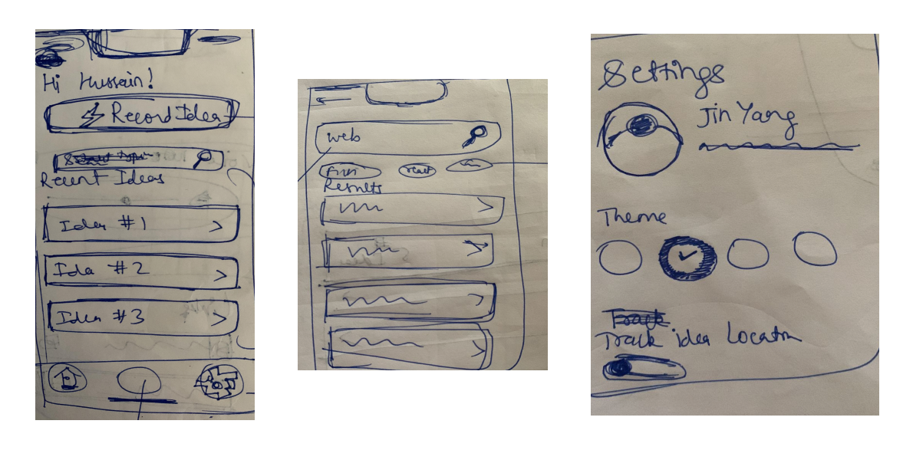

# Project Report

## Introduction

## Ideation

First of all, thank you for making it an open-ended project! This made it a very interesting project to work on. I started by asking my colleagues for suggestions. I got some pretty good ideas from them. Here are a few of them:

* A Better ToDo list application

* A Better weather application

* An app to help people decide what to cook today intelligently

* An app / platform to connect volunteers with elderly to help them with chores

But either the ideas seemed very general or huge in scope. Last month, while reading this amazing book titled "Creative Confidence" by the **Kelly** brothers, I came across this idea of keeping an idea wallet. Basically, the authors suggest to always have something (like a diary or a "whiteboard in the shower" 😂) to note down ideas, since ideas can strike you anywhere, anytime.

So, then I thought, why not create an "Idea Wallet" in the form of an app!

### The Problems

The core problems I am trying to solve with this app:

* Ideas getting lost before we can write them down or act on them

* The written record itself gets lost

* The written pieces are not always in hand

* Categorize the ideas

Idea Wallet app tries to solve the above mentioned problems along with providing features that are not possible with written records:

* Voice Notes

* Accessible storing of links

* Image / Screenshot attachments

### The Users

Me! I designed and built this app so that I can use it as my idea wallet. Eventually, I want to publish it to the app stores (both iOS and Android) for anyone to download and use.

## Design

Everything related to the design and prototype of the app can be found in this Figma file: <https://www.figma.com/file/mABEJmd0j52tGisoPglDiY/IdeaWalletApp?node-id=58%3A4928>. Basically, the product design cycle consisted of the below 4 phases/deliverables:

1. User Flow Diagram
2. Hand Sketches
3. Lo-Fi Wireframes (Grayscale / Made in Figma)
4. Hi-Fi Wireframes / Visual Design (Make it beautiful!)

Believe me, I have spent as much time, if not more, in designing the app as it took me to develop it to the current point. But having every screen designed and ready, accelerated the development speed.

### User Flow Diagram

Here, I have mapped almost all the core actions that I want the user to be able to do in the app. For instance, creating a new idea, deleting a idea, searching for an idea and more.

### Hand Sketches

Everything starts ugly. Period.

## Lo-fi Wireframes

I placed my hand sketches into the figma file and started to create a lo-fi wireframe corresponding to them one by one. This phase was all about deciding what element would go where. In this phase, I didn't worry about fonts, colors, spacing etc. Those were done in the visual design phase.

### Hi-fi Wireframes / Visual Design

This is my favorite part of the Product Design process. In my opinion, it is all about iteration, iteration and iteration! I created a mood board with all kinds of app design inspiration from all over Dribble.

This phase involved choosing colors, fonts, sizes etc. This is what makes the app look look polished and visually pleasing.

### The Core Components

I have extensively used Figma's component feature to create reusable components that are used through out the app screen designs. This also helped a lot while developing the app, as I started by directly building these components as React components which, though initially a slow process, paid of a lot at later stages.

## New Stuff Used Not in Course

* Styled Components
* Expo Google Fonts
* ESLint & Prettier Setup

## Some cool components

* Select Box
* Click to Copy
* Flash Messages
* Image Viewer

<https://github.com/jobtoday/react-native-image-viewing>

## The Emoji Picker

* Popover
* gemoji
* Performant List using Flash list

FAB Button based on: <https://snack.expo.dev/@andypandy/animated-button-above-keyboard?platform=ios>

## The `FloatingActions` component

## The Voice Note player

I wrote a voice note / sound player component basically from scratch. This is one of the components that I am very proud of.

## The Backend

* Supabase
* Supabase Auth

## What went wrong?

The Scope. I had spent so much time designing the app and aiming for a lot of features. But, I was not able to implement all of it. Here are the things that I was not able to implement while submission:

1. Settings Screen (themes)
2. Update an existing idea and its attachments
3. Sync to Cloud

## Conclusion
